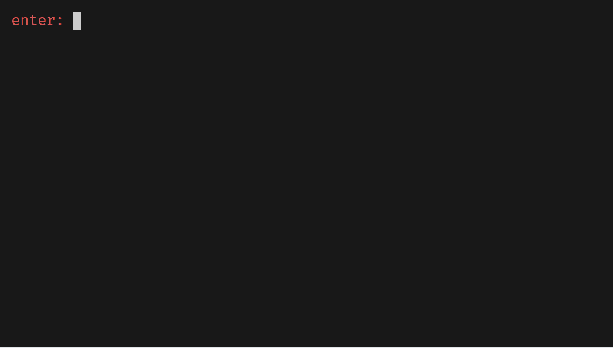
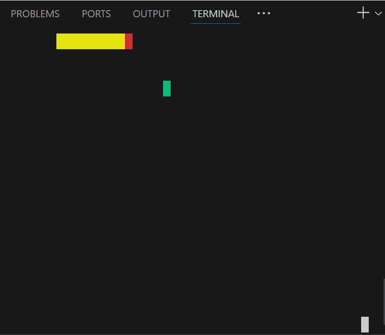
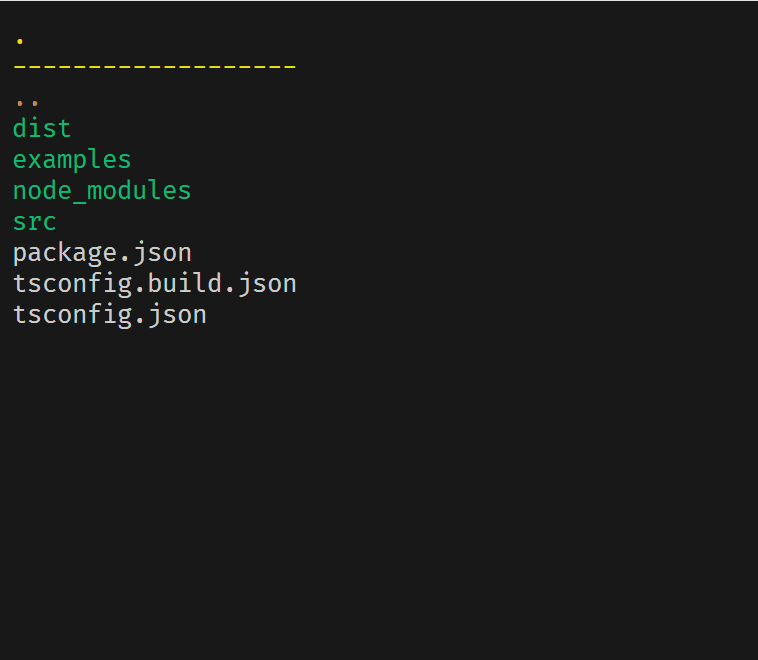
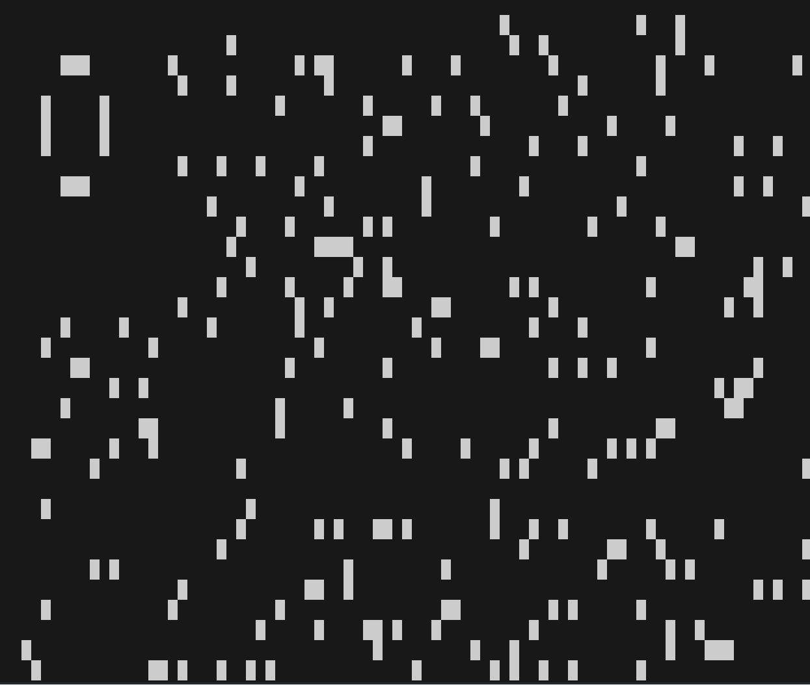

## r-tui (react terminal UI)

A simplified version of [ink](https://github.com/vadimdemedes/ink)

```tsx
export default function App() {
  return (
    <Box
      width={'100%'}
      height={'100%'}
      display="flex"
      flexDirection="row"
      justifyContent="center"
      alignItems="center"
    >
      <Box color="red" text={'hello'} />
      <Box color="green" text={'♥'} />
      <Box color="blue" text={'world'} />
    </Box>
  );
}
```


## api polyfill

For more convenient use, please ensure that the running environment contains at least the following APIs

### input

```
process.stdin.setRawMode
process.stdin.read
process.stdin.addListener("readable", cb)
process.stdin.addListener("data", cb)
process.stdout.rows
process.stdout.columns
```

### output

```
process.stdout.write
```

## example

### [cmd](./ui/src/examples/cmd.tsx)



### [snake](./ui/src/examples/snake.tsx)



### [ls](./ui/src/examples/ls.tsx)



### [life game](./ui/src/examples/life.tsx)



## txiki.js

[r-tui-txiki-react](https://github.com/ahaoboy/r-tui-txiki)
[r-tui-txiki-solidjs](https://github.com/ahaoboy/r-tui-txiki-solidjs)

### perf
| perf  | size  | time  |
| :---: | :---: | :---: |
| react | 123K  | 40ms  |
| solid |  32K  | 40ms  |

## todo

- [ ] support yoga-wasm-web api
- [ ] custom event
